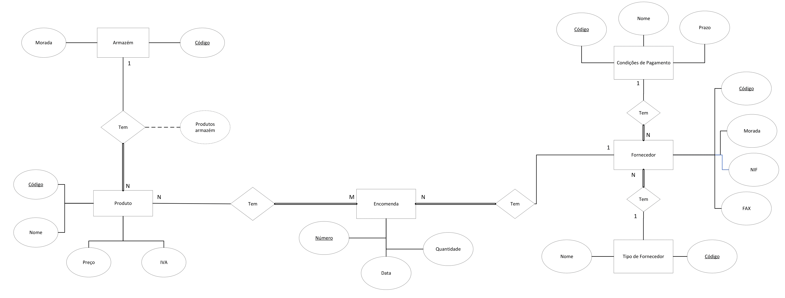
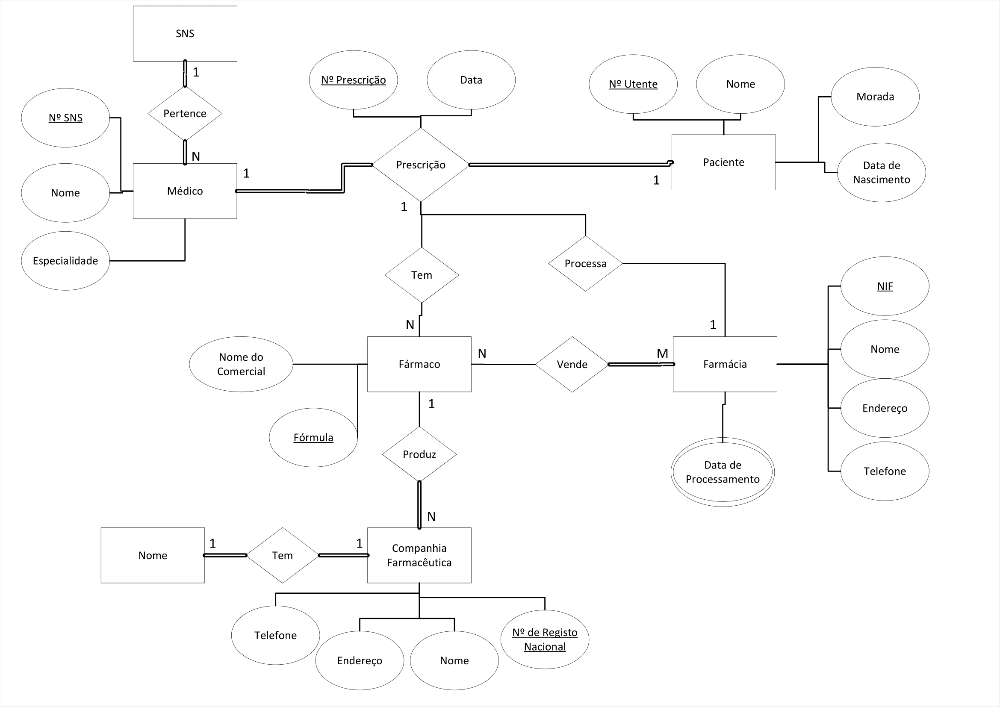
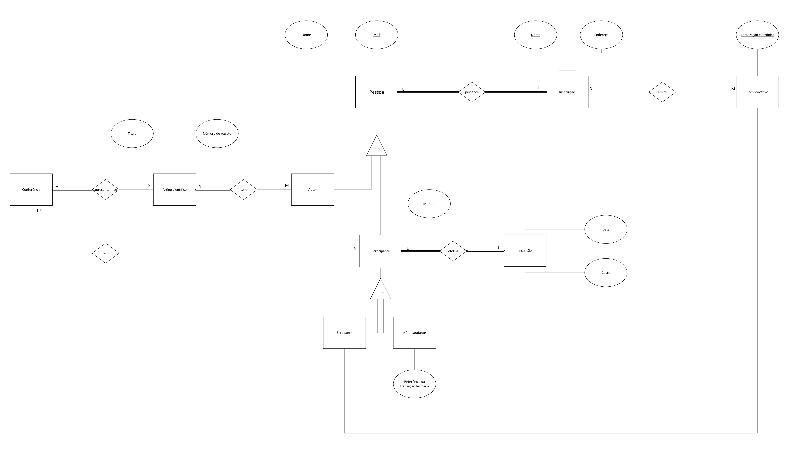

# BD: Guião 2

## Template para respostas ao guião da aula 2.
Template for submission of answers to "aula 2" guide.

## Perguntas / Questions

### Problema *2.1*

Considere um Sistema de Gestão de Stocks de uma empresa. O presente exercício propõe-se modelar a parte das encomendas desse sistema de informação segundo as seguintes premissas: 
* A empresa comercializa vários produtos que são caracterizados por um código, nome, preço e taxa de IVA; 
* Devemos saber a cada momento o número de unidades de cada produto em armazém; 
* Uma encomenda é caracterizada pelo número de encomenda, a data em que foi realizada e um fornecedor único. Uma encomenda contém um ou mais itens (i.e. produtos) e respetivas unidades; 
* Cada fornecedor é caracterizado por um nome, número de informação fiscal, endereço, número de fax, condições de pagamento (pronto, 30 dias, 60 dias, etc) e um código interno do tipo de fornecedor (ao qual está, por sua vez, associada uma designação); 

#### *a)* Identifique as entidades, atributos e relações da base de dados.
Identify the entities, attributes, and relationships of the database.

```
... Write here your answer ...
Armazém: Código, Morada
PK: Código
Fk(n):(none)

Produto: Código, Nome, Preço, IVA
PK: Código
Fk(n):(none)

Encomenda: Número, Data, Fornecedor_Codigo, Produto_Codigo, Quantidade
PK: Número
Fk(n):(Fornecedor_Codigo, Produto_Codigo)

Fornecedor: Código, Nome, NIF, Morada, FAX, Cond_Pagamento, Tipo_Fornecedor
PK: Código
Fk(n):(Cond_Pagamento, Tipo_Fornecedor)

Cond_Pagamento: Código, Nome, Prazo
PK: Código
Fk(n):(none)

Tipo_Fornecedor: Código, Nome
PK: Código
Fk(n):(none)
```

#### *b)* Caracterize as relações quanto ao grau, cardinalidade e obrigatoriedade de participação das instâncias das entidades no relacionamento.
Specify the relationships regarding the degree, cardinality and instances mandatory participation of the entities in the relationship.

```
... Write here your answer ...
O grau da relação relaciona-se com o número de entidades participantes num relacionamento.
Assim, caracterizando as relações quanto ao grau podemos concluir que são todas binárias.
Quanto à cardinalidade, relação entre o número de ocorrências numa entidade com as respetivas ocorrências na outra
entidade com quem tem o relacionamento, temos exemplos de relação 1:N e N:M.
Para relação 1:N temos relações como Armazem-Produto, Produto-Encomenda, Fornecedor-Encomenda, Cond_pagamento-Fornecedor
e Tipo_Forncedor-Fornecedor.
A relação Produto-Encomenda pode ser do tipo de relação de cardinalidade anteriormente apresentado, 1:N,
mas também pode ser do tipo N:M.
No que diz respeito à obrigatoriedade esta pode-se dividir em participação total(obrigatório) ou participação parcial(opcional).
Por exemplo, é obrigatório que a Encomenda tenha pelo menos um Produto logo utiliza-se uma ligação por linha dupla, como se pode verificar no gráfico.
Casos como uma Encomenda ter uma Fornecedor, um Fornecedor ser de um Tipo de Fornecedor, um Fornecedor ter uma Condição de Pagamento e um Produto estar
num Armazém são relações de participação total quanto à sua obrigatoriedade.
Relações como um Armazem ter um Produto, um Fornecedor ter uma Encomenda e um Produto ter uma Encomenda são relações de participação parcial.
```

#### *c)* Desenvolva o desenho conceptual da base de dados com recurso a um diagrama entidade-relacionamento. Numa primeira fase, utilize lápis e papel para realizar o trabalho. Uma vez concluído o desenho em papel, transponha o diagrama para um formato eletrónico utilizando uma ferramenta gráfica como, por exemplo, o Microsoft Visio ou o Visual Paradigm.



### Problema *2.2*

Considere um Sistema de Prescrição Eletrónica de Medicamentos com as seguintes características: 

* Uma prescrição é efetuada por um médico do Sistema Nacional de Saúde (SNS) para um paciente, envolvendo um ou mais fármacos. Cada prescrição tem associada um número único de prescrição e uma data. 
* Um médico é caracterizado por um número de identificação atribuído pelo SNS, um nome e uma especialidade; 
* Um paciente é caracterizado por um número de utente, nome, data de nascimento e endereço; 
* Um fármaco é caracterizado por um nome comercial (que pode não ser único) e uma fórmula. Um fármaco é produzido por uma companhia farmacêutica e o seu nome é único entre todos os produtos dessa farmacêutica; 
* Uma farmacêutica é caracterizada por um número de registo nacional, nome, endereço e telefone; 
* Os fármacos são vendidos em farmácias. Uma prescrição é processada por uma única farmácia, i.e. não é possível adquirir parte dos fármacos de uma mesma prescrição em farmácias distintas;   
* Pretendemos guardar a data em que uma prescrição foi processada na farmácia. No entanto, há situações em que os pacientes não fazem uso da prescrição; 
* Uma farmácia é caracterizada por um nif, nome, endereço e telefone. 

#### *a)* Desenvolva o desenho conceptual da base de dados do Sistema de Prescrição Eletrónica de Medicamentos com recurso a um diagrama entidade-relacionamento.



### Problema 2.3

Considere um Sistema de Gestão de Conferências com as seguintes características: 
* Numa conferência são apresentados vários artigos científicos, cada um caracterizado por um título e um número de registo;  
* Um artigo tem um ou mais autores caracterizados por um nome, endereço de email, e instituição;  
* Uma pessoa pode ser autor de vários artigos; 
* Uma instituição é caracterizada por um nome e endereço;  
* Numa conferência temos ainda os participantes para os quais pretendemos registar o nome, morada, endereço de email, instituição e data de inscrição; 
* Há dois tipos de participantes: estudantes e não estudantes;  
* Os participantes estudantes necessitam de um comprovativo emitido pela instituição de ensino para estarem isentos do custo da inscrição. O sistema de informação deve registar a localização eletrónica do referido comprovativo; 
* Para os participantes não estudantes é necessário registar a referência da transação bancária que suportou o valor da inscrição.  


#### *a)* Desenvolva o desenho conceptual da base de dados do Sistema de Gestão de Conferências com recurso a um diagrama entidade-relascionamento.



```
A imagem é ligeiramente grande o que faz com que não apareça nítida mas o png mostra o desenho direito.
```

### Problema 2.4

Considere um Sistema de Gestão de um ATL com as seguintes características:  
* O ATL está organizado por turmas com determinada escolaridade e existem 5 classes: 0 (pré-escola), 1, 2, 3 e 4; 
* Uma turma é caracterizada por um identificador, ano letivo, uma designação, um professor e um número máximo de alunos; 
* Existe um conjunto de atividades disponíveis para uma ou mais turmas. Cada atividade tem um identificador, uma designação e um custo (valor financeiro) associado. A frequência de uma atividade, por parte de um aluno de uma turma, é facultativa;    
* Um aluno é caracterizado por nome, número de cartão de cidadão, morada e data de nascimento; 
* Um professor é caracterizado por um número de funcionário, nome, número de cartão de cidadão, morada, data de nascimento, contacto telefónico e email; 
* Um aluno tem um encarregado de educação caracterizado por nome, número de cartão de cidadão, morada, data de nascimento, contacto telefónico, email e uma relação com o aluno (pai, mãe, avô, avó, etc); 
* Existe uma lista de pessoas com autorização para entregar ou levantar o aluno. Estas pessoas têm um tipo de registo similar ao encarregado de educação. 

#### *a)* Desenvolva o desenho conceptual da base de dados do Sistema de Informação da Universidade com recurso a um diagrama entidade-relacionamento.


### *b)* [Opcional] Continue a modelar o problema de forma a registar os processos financeiros (mensalidades, atividades, pagamentos, desconto família, etc). Defina os requisitos livremente.


    