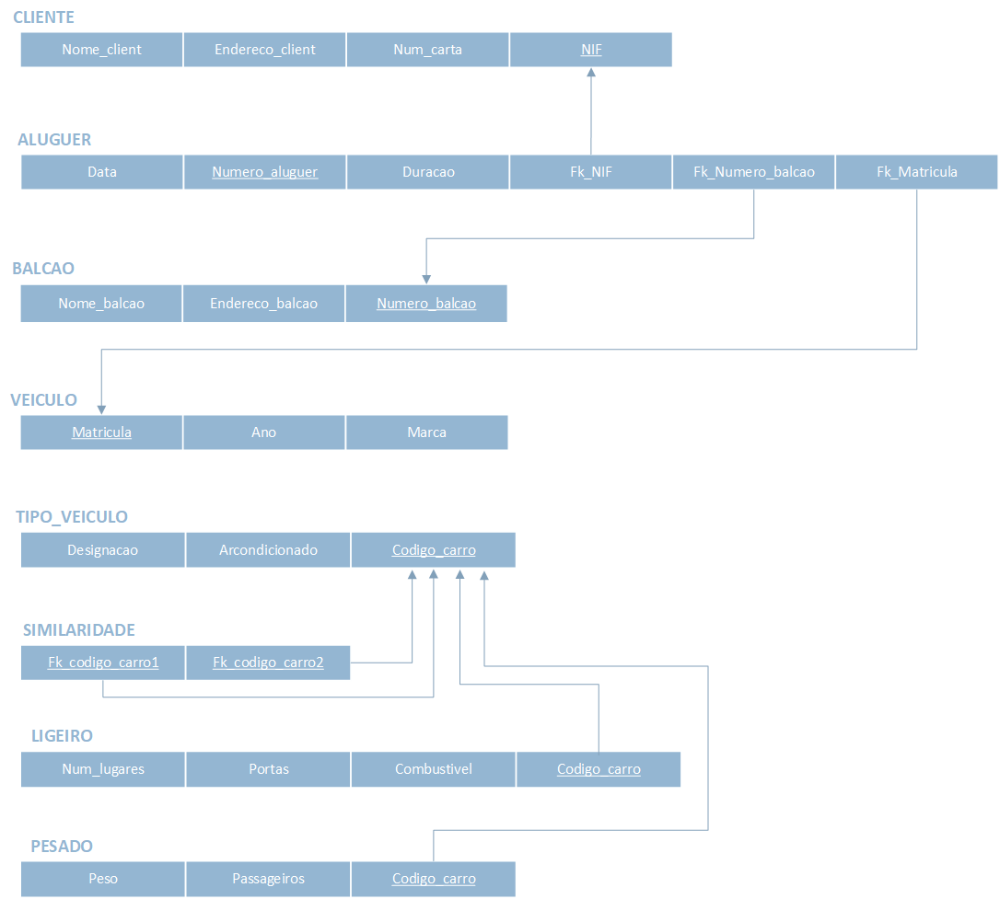
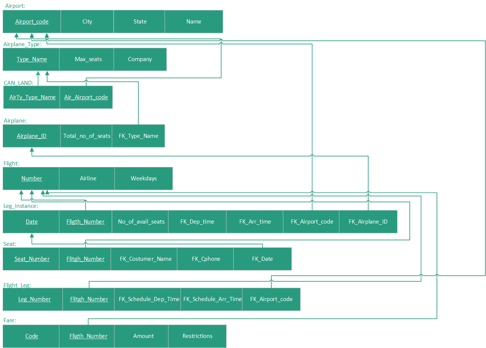
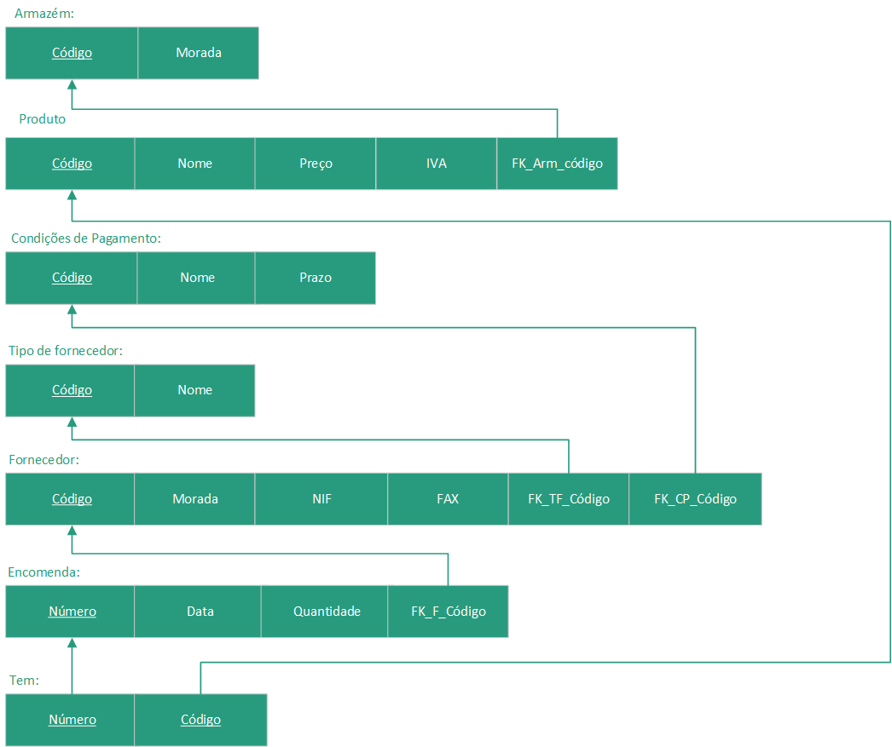
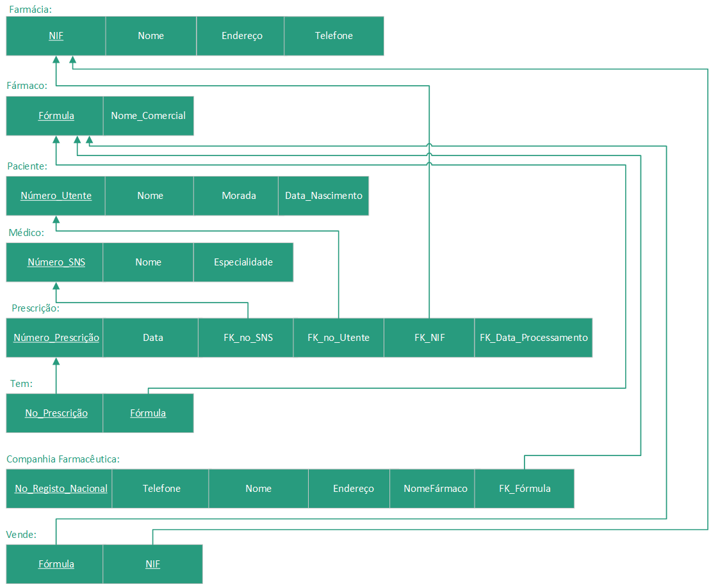
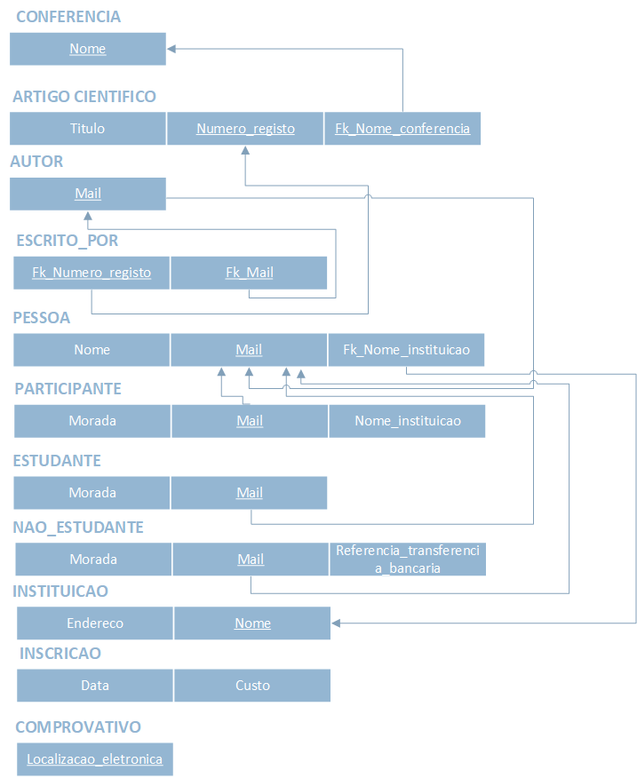
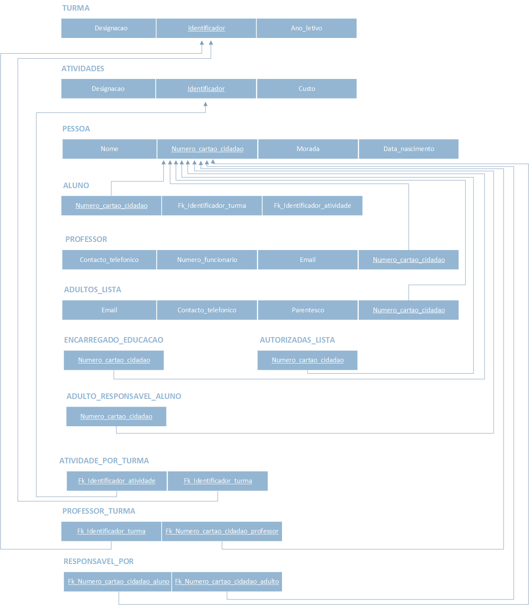

# BD: Guião 3


## ​Problema 3.1
 
### *a)*

```
... Write here your answer ...
cliente(nome, endereco, num_carta, NIF)
aluguer(data, numero, duracao)
balcao(nome, endereco, numero)
veiculo(ano, matricula, marca)
tipo_veiculo(designacao, arcondicioado, codigo)
ligeiro(numlugares, portas, combustivel)
pesado(peso, passageiros)
similaridade(codigo1, codigo2)
```


### *b)* 

```
... Write here your answer ...
cliente
    candidate_keys: Num_carta, NIF
    primary_keys: NIF
    foreign_keys: -
aluguer
    candidate_keys: Numero_aluguer, Data
    primary_keys: Numero_aluguer
    foreign_keys: NIF, Numero_balcao, Matricula
balcao
    candidate_keys: Endereco_balcao, Numero_balcao
    primary_keys: Numero_balcao
    foreign_keys: -
veiculo
    candidate_keys: Matricula, Marca
    primary_keys: Matricula
    foreign_keys: -
tipo_veiculo
    candidate_keys: Codigo_carro, designacao
    primary_keys: Codigo_carro
    foreign_keys: -
similaridade
    candidate_keys: Codigo_carro1, Codigo_carro2
    primary_keys: Codigo_carro1, Codigo_carro2
    foreign_keys: Codigo_carro1, Codigo_carro2
ligeiro
    candidate_keys: Codigo_carro
    primary_keys: Codigo_carro
    foreign_keys: -
tipo_veiculo
    candidate_keys: Codigo_carro, Peso
    primary_keys: Codigo_carro
    foreign_keys: -
```


### *c)* 




## ​Problema 3.2

### *a)*

```
... Write here your answer ...
airport(airport_code, city, state, name)
flight_leg(leg_no)
airplane_type(company, type_name, max_seats)
airplane(airplane_id, total_no_of_seats)
seat(seat_no)
flight(number, airline, weekdays)
fare(restrictions, amount, code)
leg_instance(not_of_avail_seats, date)
can_land(airty_type_name, air_airport_code)
```


### *b)* 

```
... Write here your answer ...
Airport: 
c(k) = Airport_code
pk = Airport_code
fk = (none)

CAN_LAND:
c(k) = Air_Airport_code, AirTy_Type_Name
pk = Air_Airport_code, AirTy_Type_Name
fk = (none)

Airplane_Type: 
c(k) = Type_Name
pk = Type_Name
fk = (none)

Airplane:
c(k) = Airplane_ID
pk = Airplane_ID
fk = Type_Name

Leg_Instance:
c(k) = Date, flight_Number
pk = Date, flight_Number
fk = Dep_Time, Arr_Time , Aírport_Code, Airplane_ID

Seat: 
c(k) = Seat_Number, flight_Number
pk = Seat_Number, flight_Number
fk = Costumer_Name, Cphone, Date 

Flight_Leg: 
c(k) =  Leg_Number, flight_Number
pk =  Leg_Number, flight_Number
fk =  Schedule_dep_Time, Schedule_arr_Time, Airport_Code

Flight: Number, Airline, Weekdays
c(k) = Number
pk = Number
fk = (none)

Fare: 
c(k) = Code, flight_Number
pk = Code, flight_Number
fk = (none)
```


### *c)* 




## ​Problema 3.3


### *a)* 2.1



### *b)* 2.2



### *c)* 2.3



### *d)* 2.4

